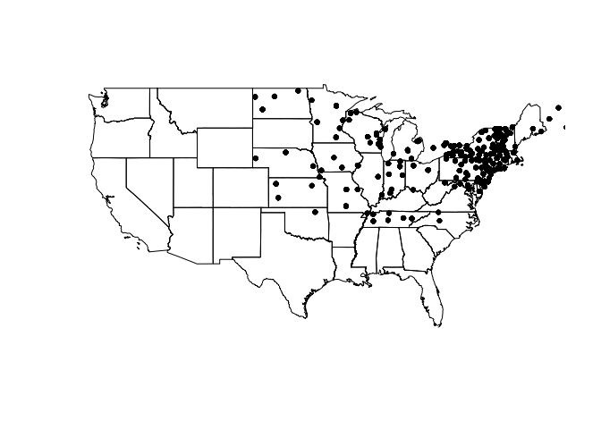
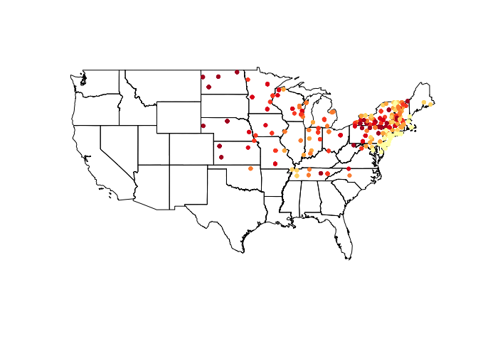
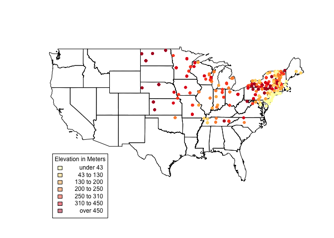
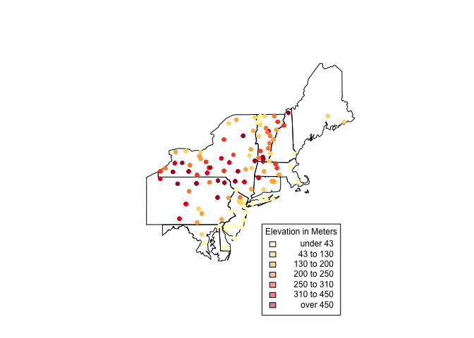

In real estate, spatial data is the name of the game. Countless programs
in other domains utilize the power of this data, which is becoming more
prevalent by the day.

In this post I will go over a few simple, but powerful tools to get you
started using using geographic information in R.

    ##First, some libraries##
    #install.packages('GISTools', dependencies = T)
    library(GISTools)

`GISTools` provides an easy-to-use method for creating shading schemes
and choropleth maps. Some of you may have heard of the `sp` package,
which adds numerous spatial classes to the mix. There are also functions
for analysis and making things look nice.

Let's get rolling: source the `vulgaris` dataset, which contains
location information for Syringa Vulgaris (the Lilac) observation
stations and US states. This code plots the states and `vulgaris`
points.

    data("vulgaris")          #load data
    par = (mar = c(2,0,0,0))  #set margins of plot area
    plot(us_states)
    plot(vulgaris, add = T, pch = 20)

One thing to note here is the structure of these objects. `us_states` is
a SpatialPolygonsDataFrame, which stores information for plotting shapes
(like a shapefile) within its attributes. `vulgaris` by contrast is a
SpatialPointsDataFrame, which contains data for plotting individual
points. Much like a `data.frame` and `$`, these objects harbor
information that can be accessed via `@`.

    kable(head(vulgaris@data))

<table>
<thead>
<tr class="header">
<th></th>
<th align="right">Station</th>
<th align="right">Year</th>
<th align="left">Type</th>
<th align="right">Leaf</th>
<th align="right">Bloom</th>
<th align="left">Station.Name</th>
<th align="left">State.Prov</th>
<th align="right">Lat</th>
<th align="right">Long</th>
<th align="right">Elev</th>
</tr>
</thead>
<tbody>
<tr class="odd">
<td>3695</td>
<td align="right">61689</td>
<td align="right">1965</td>
<td align="left">Vulgaris</td>
<td align="right">114</td>
<td align="right">136</td>
<td align="left">COVENTRY</td>
<td align="left">CT</td>
<td align="right">41.8</td>
<td align="right">-72.35</td>
<td align="right">146</td>
</tr>
<tr class="even">
<td>3696</td>
<td align="right">61689</td>
<td align="right">1966</td>
<td align="left">Vulgaris</td>
<td align="right">122</td>
<td align="right">146</td>
<td align="left">COVENTRY</td>
<td align="left">CT</td>
<td align="right">41.8</td>
<td align="right">-72.35</td>
<td align="right">146</td>
</tr>
<tr class="odd">
<td>3697</td>
<td align="right">61689</td>
<td align="right">1967</td>
<td align="left">Vulgaris</td>
<td align="right">104</td>
<td align="right">156</td>
<td align="left">COVENTRY</td>
<td align="left">CT</td>
<td align="right">41.8</td>
<td align="right">-72.35</td>
<td align="right">146</td>
</tr>
<tr class="even">
<td>3698</td>
<td align="right">61689</td>
<td align="right">1968</td>
<td align="left">Vulgaris</td>
<td align="right">97</td>
<td align="right">134</td>
<td align="left">COVENTRY</td>
<td align="left">CT</td>
<td align="right">41.8</td>
<td align="right">-72.35</td>
<td align="right">146</td>
</tr>
<tr class="odd">
<td>3699</td>
<td align="right">61689</td>
<td align="right">1969</td>
<td align="left">Vulgaris</td>
<td align="right">114</td>
<td align="right">138</td>
<td align="left">COVENTRY</td>
<td align="left">CT</td>
<td align="right">41.8</td>
<td align="right">-72.35</td>
<td align="right">146</td>
</tr>
<tr class="even">
<td>3700</td>
<td align="right">61689</td>
<td align="right">1970</td>
<td align="left">Vulgaris</td>
<td align="right">111</td>
<td align="right">135</td>
<td align="left">COVENTRY</td>
<td align="left">CT</td>
<td align="right">41.8</td>
<td align="right">-72.35</td>
<td align="right">146</td>
</tr>
</tbody>
</table>

Let's take a look at some functions that use this data.

    newVulgaris <- gIntersection(us_states, vulgaris, byid = T)
    kable(head(data.frame(newVulgaris)))

<table>
<thead>
<tr class="header">
<th></th>
<th align="right">x</th>
<th align="right">y</th>
</tr>
</thead>
<tbody>
<tr class="odd">
<td>3 4896</td>
<td align="right">-67.65</td>
<td align="right">44.65</td>
</tr>
<tr class="even">
<td>3 4897</td>
<td align="right">-67.65</td>
<td align="right">44.65</td>
</tr>
<tr class="odd">
<td>3 4898</td>
<td align="right">-67.65</td>
<td align="right">44.65</td>
</tr>
<tr class="even">
<td>3 4899</td>
<td align="right">-67.65</td>
<td align="right">44.65</td>
</tr>
<tr class="odd">
<td>3 4900</td>
<td align="right">-67.65</td>
<td align="right">44.65</td>
</tr>
<tr class="even">
<td>3 4901</td>
<td align="right">-67.65</td>
<td align="right">44.65</td>
</tr>
</tbody>
</table>

`gIntersection`, as you may have guessed from the name, returns the
intersection of two spatial objects. In this case, we are given the
points from `vulgaris` that are within `us_states`. However, the rest of
the `vulgaris` data has been stripped from the resulting object. We've
got to jump through a couple of hoops to get that information back.

    newVulgaris <- data.frame(newVulgaris)
    tmp <- rownames(newVulgaris)
    tmp <- strsplit(tmp, " ")
    tmp <- (sapply(tmp, "[[", 2))
    tmp <- as.numeric(tmp)
    vdf <- data.frame(vulgaris)
    newVulgaris <- subset(vdf, row.names(vdf) %in% tmp)

<table>
<thead>
<tr class="header">
<th></th>
<th align="right">Station</th>
<th align="right">Year</th>
<th align="left">Type</th>
<th align="right">Leaf</th>
<th align="right">Bloom</th>
<th align="left">Station.Name</th>
<th align="left">State.Prov</th>
<th align="right">Lat</th>
<th align="right">Long</th>
<th align="right">Elev</th>
<th align="right">Long.1</th>
<th align="right">Lat.1</th>
<th align="left">optional</th>
</tr>
</thead>
<tbody>
<tr class="odd">
<td>3695</td>
<td align="right">61689</td>
<td align="right">1965</td>
<td align="left">Vulgaris</td>
<td align="right">114</td>
<td align="right">136</td>
<td align="left">COVENTRY</td>
<td align="left">CT</td>
<td align="right">41.8</td>
<td align="right">-72.35</td>
<td align="right">146</td>
<td align="right">-72.35</td>
<td align="right">41.8</td>
<td align="left">TRUE</td>
</tr>
<tr class="even">
<td>3696</td>
<td align="right">61689</td>
<td align="right">1966</td>
<td align="left">Vulgaris</td>
<td align="right">122</td>
<td align="right">146</td>
<td align="left">COVENTRY</td>
<td align="left">CT</td>
<td align="right">41.8</td>
<td align="right">-72.35</td>
<td align="right">146</td>
<td align="right">-72.35</td>
<td align="right">41.8</td>
<td align="left">TRUE</td>
</tr>
<tr class="odd">
<td>3697</td>
<td align="right">61689</td>
<td align="right">1967</td>
<td align="left">Vulgaris</td>
<td align="right">104</td>
<td align="right">156</td>
<td align="left">COVENTRY</td>
<td align="left">CT</td>
<td align="right">41.8</td>
<td align="right">-72.35</td>
<td align="right">146</td>
<td align="right">-72.35</td>
<td align="right">41.8</td>
<td align="left">TRUE</td>
</tr>
<tr class="even">
<td>3698</td>
<td align="right">61689</td>
<td align="right">1968</td>
<td align="left">Vulgaris</td>
<td align="right">97</td>
<td align="right">134</td>
<td align="left">COVENTRY</td>
<td align="left">CT</td>
<td align="right">41.8</td>
<td align="right">-72.35</td>
<td align="right">146</td>
<td align="right">-72.35</td>
<td align="right">41.8</td>
<td align="left">TRUE</td>
</tr>
<tr class="odd">
<td>3699</td>
<td align="right">61689</td>
<td align="right">1969</td>
<td align="left">Vulgaris</td>
<td align="right">114</td>
<td align="right">138</td>
<td align="left">COVENTRY</td>
<td align="left">CT</td>
<td align="right">41.8</td>
<td align="right">-72.35</td>
<td align="right">146</td>
<td align="right">-72.35</td>
<td align="right">41.8</td>
<td align="left">TRUE</td>
</tr>
<tr class="even">
<td>3700</td>
<td align="right">61689</td>
<td align="right">1970</td>
<td align="left">Vulgaris</td>
<td align="right">111</td>
<td align="right">135</td>
<td align="left">COVENTRY</td>
<td align="left">CT</td>
<td align="right">41.8</td>
<td align="right">-72.35</td>
<td align="right">146</td>
<td align="right">-72.35</td>
<td align="right">41.8</td>
<td align="left">TRUE</td>
</tr>
</tbody>
</table>

Look familiar? Now we've got a data frame with the clipped `vulgaris`
values and original data preserved.

    vulgarisSpatial <- SpatialPointsDataFrame(data.frame(newVulgaris$Long, newVulgaris$Lat), newVulgaris, proj4string = CRS(proj4string(vulgaris)), bbox = vulgaris@bbox)

After storing our clipped data frame as a SpatialPointsDataFrame, we can
again make use of it - in this case we add a shading scheme to the
`vulgaris` points.

    shades <- auto.shading(vulgarisSpatial@data$Elev, n = 7, cols = brewer.pal(7, 'YlOrRd'))  #Check cutter arg for more ways to create breaks.
    shades$cols <- add.alpha(shades$cols, .5)
    plot(us_states)
    choropleth(vulgarisSpatial, vulgarisSpatial$Elev,shading = shades, add = T, pch = 20)

Colors are pretty, but what do they mean? Let's add a legend.

    us_states@bbox #Get us_states bounding box coordinates.

    ##           min       max
    ## r1 -124.73142 -66.96985
    ## r2   24.95597  49.37173

    plot(us_states)
    choropleth(vulgarisSpatial, vulgarisSpatial$Elev,shading = shades, add = T, pch = 20)
    par(xpd=TRUE)           #Allow plotting outside of plot area.
    choro.legend(-124, 30, shades, cex = .75, title = "Elevation in Meters") # Plot legend in bottom left.  Takes standard legend() params.

It looks like there's a lot going on in the Northeastern states. For a
closer look, create another clipping (like above) and plot it. Using the
structure below, we can create a selection vector. I have hidden the
full code since it is repetitive (check GitHub for the full code.)

    index <- us_states$STATE_NAME == "Pennsylvania"
             '...'

    plot(us_states[index,])
    choropleth(vulgarisNE, vulgarisNE$Elev,shading = shades, add = T, pch = 20)
    par(xpd = T)
    choro.legend(-73, 39.75, shades, cex = .75, title = "Elevation in Meters")

Hopefully this has been a useful introduction (or refresher) on spatial
data. I always learn a lot in the process of writing these posts. If you
have any comments or suggetions please leave a comment or feel free to
contact me!

Happy mapping,

Kiefer
